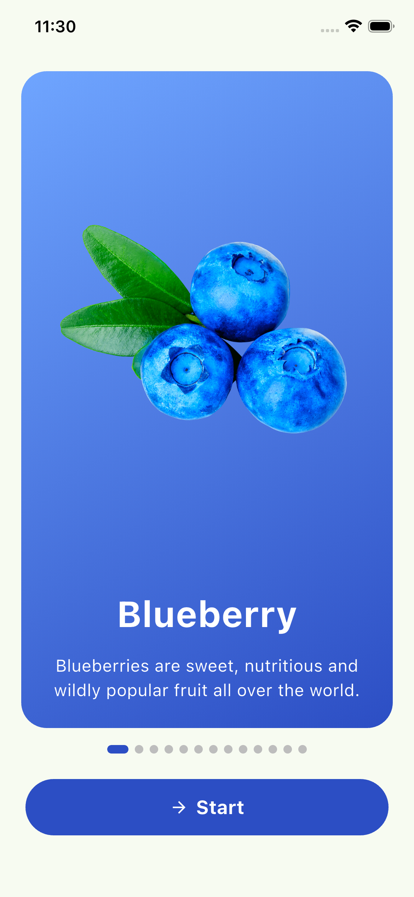
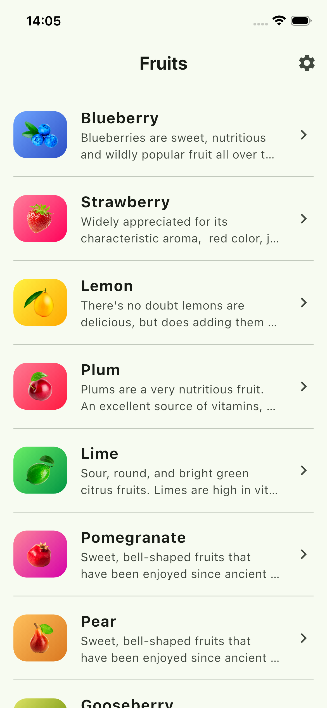
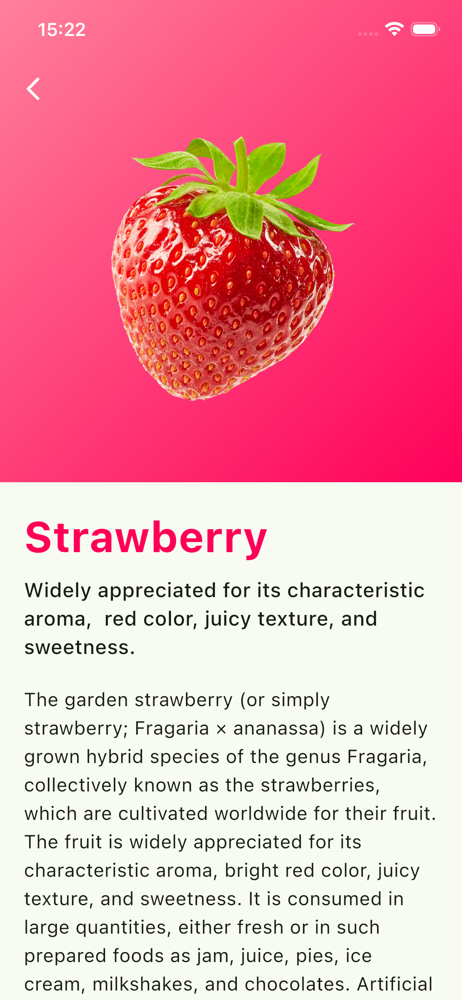
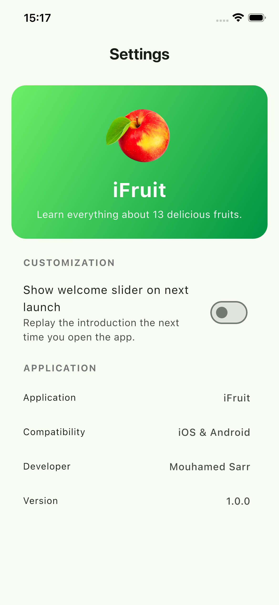

# iFruit

A Flutter app to discover 13 fruits: browse the list, open a fruit and learn everything about it (description and nutrition facts).

A short demo video is available in [demo.mp4](demo.mp4).

## Screens

| Welcome | Fruit list | Fruit detail | Settings |
|---|---|---|---|
|  |  |  |  |

- **Welcome (ContentView)**: a slider of fruit cards with a Start button. Shown only on the first launch of the app.
- **Fruit list (FruitListView)**: every fruit with its image, name and a short description. A settings button sits in the top right corner. Tap a fruit to open its detail page.
- **Fruit detail (FruitDetailView)**: large image on the fruit's color gradient, full description and nutrition facts (per 100 g).
- **Settings (SettingsView)**: app info and an option to replay the welcome slider.

## Run

```bash
flutter pub get
flutter run
```

## Project structure

```
lib/
  main.dart              # entry point, first-launch check
  models/fruit.dart      # Fruit model
  data/fruits_data.dart  # the 13 fruits (from the provided resources)
  screens/               # the 4 screens
assets/images/           # fruit images
```
